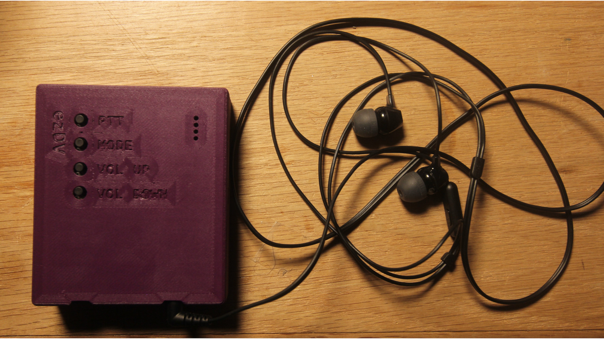

# Setting Up ezDV

## Initial Assembly

If ezDV did not already come with a battery, you will need to obtain a 3.7V lithium polymer (LiPo) battery.
One recommended battery can be purchased [from Amazon](https://www.amazon.com/gp/product/B08214DJLJ/ref=ppx_yo_dt_b_search_asin_title?ie=UTF8&psc=1).

*WARNING: Do not puncture or otherwise damage lithium batteries as injury and/or property damage could result!
Neither the project nor its creator take responsibility for any damage or injury due to misuse of batteries. A 
battery with a protection module (such as the one linked above) is highly recommended.*

The battery should be plugged into the BT1 connector on the bottom of the ezDV circuit board, which is
the circled connector below:

Finally, plug in a wired headset on the TRRS jack located on the right side of the ezDV board (when looking
from above). This headset should be wired for compatibility with Android phones, which is as follows:

* Tip: RX audio from ezDV
* Ring 1: RX audio from ezDV
* Ring 2: GND
* Shield: TX microphone audio to ezDV

Once attached, ezDV will appear as follows:

### Radios without Wi-Fi support

Radios without Wi-Fi support will need an interface cable. One end of this cable should 
be a male 3.5mm four conductor (TRRS) with the following pinout:

* Tip: TX audio from ezDV to your radio
* Ring 1: PTT to radio (this is connected to GND when you push the PTT button)
* Ring 2: GND
* Shield: RX audio from your radio to ezDV

If you have an Elecraft KX3, you can use off the shelf parts for your interface cable
(no soldering required). These parts consist of a [3.5mm splitter](https://www.amazon.com/Headphone-Splitter-KOOPAO-Microphone-Earphones/dp/B084V3TRTV/ref=sr_1_3?crid=2V0WV9A8JJMW9&keywords=headset%2Bsplitter&qid=1671701520&sprefix=headset%2Bsplitte%2Caps%2C136&sr=8-3&th=1)
and a [3.5mm TRRS cable](https://www.amazon.com/gp/product/B07PJW6RQ7/ref=ppx_yo_dt_b_search_asin_title?ie=UTF8&psc=1). The microphone
connector on the splitter should be plugged into PHONES on the KX3 while the speaker connector should be plugged into MIC.

Once you've built or purchased an interface cable, you should plug this cable into the
3.5mm jack on the left hand side of the ezDV board (when looking upward). There is also
silkscreen labeling on the back of the board corresponding to the location of the radio
jack.