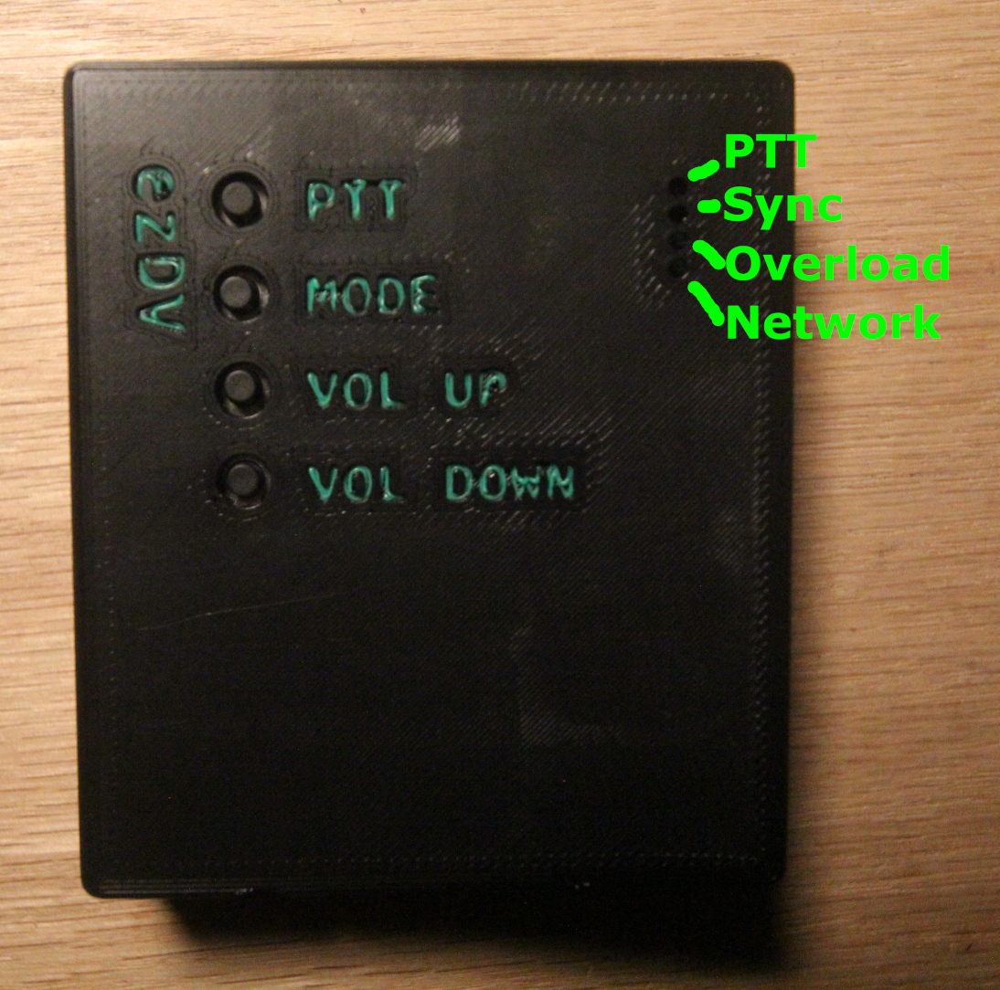

# Basic Usage

## External Controls

ezDV has four buttons on the left, in order from top to bottom:

* Push To Talk (PTT)
* Mode
* Volume Up
* Volume Down

as well as four status LEDs on the right hand side (again from top to bottom):

* PTT (red; on if transmitting)
* Sync (green; on if ezDV can decode an incoming FreeDV signal)
* Overload (red; on if the incoming RX/TX audio is clipping)
* Network (blue; will blink if it has a network connection and will be solid if connected to the radio)

These controls and LEDs are shown below:

## Powering ezDV on and off

To turn on ezDV, press and hold the Mode button for >= 1 second. All four LEDs on the right hand side
of the board should light briefly and then extinguish. You will also hear the last used
mode in Morse Code on your wired headset. (On first start, this will be "ANA", which corresponds to
analog passthrough mode.) Holding this button again for >= 1 second will result in ezDV turning off 
(with "73" also being piped through the headset in Morse Code, corresponding to the well-known ham 
radio term for "goodbye").

If Wi-Fi is enabled on ezDV, you will additionally hear the letter "N" emitted in Morse Code
once the network interface comes up. If ezDV is configured to connect to an existing wireless
network, you will hear the last octet of the IP address immediately afterward. For example,
if your router assigns the IP address "192.168.1.100" to ezDV, you will hear "N100" in the headset.

*Note: if your wireless network is configured with a "netmask" other than "255.255.255.0", you may need to
load your router's configuration to obtain the rest of ezDV's IP address. Otherwise, you can typically replace
the last octet of your computer's IP address with the number after the "N" when accessing ezDV with
a web browser.*

## FreeDV Operation

Pushing the Mode button briefly while in receive will cycle through the following modes:

* FreeDV 700D ("700D" will beep in Morse code)
* FreeDV 700E ("700E" will beep in Morse code)
* FreeDV 1600 ("1600" will beep in Morse code)
* Analog passthrough ("ANA" will beep in Morse code)

Pressing and holding the PTT button will place the radio into transmit mode and transmit
a FreeDV signal out over the air (or your voice verbatim if you are in analog passthrough mode).
Additionally, if you hold down PTT and then push Mode briefly, the voice keyer function will activate. This
requires additional configuration to use (see "Web based configuration" below). Pressing any button after
doing this will stop the voice keyer.

If your radio has a "data" mode, it's recommended to enable this while using ezDV (or any FreeDV application
or device). This typically disables any processing the radio would normally do for SSB voice, preventing the 
signal from being garbled. Please see your radio's user manual for information about how to enable this mode.

## Volume Controls

The Volume Up and Down buttons adjust the receive audio by default. If the PTT button is also held while
pushing Volume Up or Volume Down, the transmit audio level is adjusted instead. For best results, transmit 
audio should be adjusted while in 700D/700E/1600 mode such that the ALC indicator on your radio is just barely
showing (similar to how to configure data modes).
