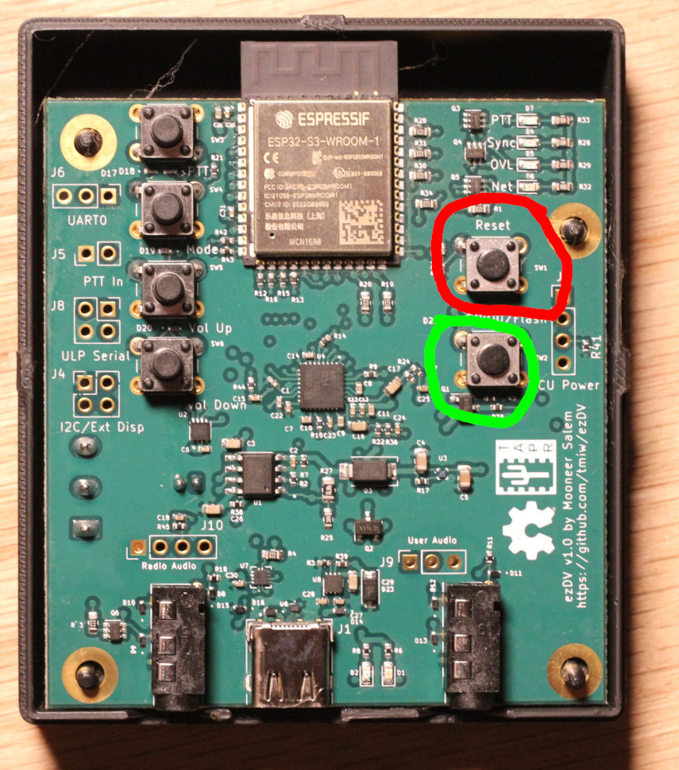

# Troubleshooting

This section contains some helpful tips and information that may help you diagnose and fix any problems you may have with ezDV.

## Using Hardware Test Mode

ezDV has a hardware test mode that can be used to ensure that the board is functioning properly. To access this mode,
hold down the PTT button while turning on ezDV. Once ezDV starts, you will hear audio tones at 1275 Hz (user jack) and 
1725 Hz (radio jack) and all LEDs will be lit at 50% duty cycle. If the board is functioning properly, only the frequency
associated to the given jack (and harmonics, if square wave) will be in the output audio. Pushing the Mode button will cycle 
through the following:

* Sine tones at both jacks.
* Sine tone only on user jack.
* Sine tone only on radio jack.
* Square tones at both jacks.
* Square tone only on user jack.
* Square tone only on radio jack.
* No audio on either jack.

Additionally, pushing any of the buttons will extinguish the following LEDs if the buttons are properly functioning:

* PTT: PTT (red)
* Mode: Sync (green)
* Volume Up: Overload (red)
* Volume Down: Network (blue)

Releasing the button will re-illuminate the associated LED.

To shut down ezDV while in this mode, long-press the Mode button as with regular operation.

## Resetting ezDV

In the event that ezDV is non-responsive and needs to be reset, you can open the ezDV enclosure to gain access to two
buttons that are hidden in normal use. These are the Reset and Flash buttons as shown below:



Pressing and releasing the Reset button will cause ezDV to restart execution of its firmware. If the Flash button is held
while pressing and releasing the Reset button, the ESP32-S3 on ezDV will enter into "firmware download mode", which will allow
you to clear ezDV's internal memory and allow you to load a new copy of its firmware. To do this, you will need to plug ezDV into a USB
port on your PC and either install esptool, ESP-IDF or ESP Flash Tool onto your PC's hard drive.

### Using ESP-IDF to flash firmware

Download a copy of the ezDV firmware source code (typically listed as "Source code (zip)" or "Source code (tar.gz)" on the 
[project's release page](https://github.com/tmiw/ezDV/releases)). Decompress the file, change into the folder that is created,
then run the following commands to build and flash the firmware:

```
. ~/esp/esp-idf/export.sh
cd firmware
idf.py -p /dev/ttyxxx0 build erase-flash flash
```

Where `/dev/ttyxxx0` (or `COMx:` on Windows) is the serial port created by your operating system after plugging ezDV in. Once complete,
ezDV will automatically reboot and execute the firmware that's been flashed.

*Note: The above will erase all of your settings and reset them to defaults. If you don't want to do this, remove `erase-flash` from
the above command.*

### Using ESP Flash Tool

On Windows, you can use the ESP Flash Tool to flash ezDV. This does not require installation of ESP-IDF.

1. Download the ESP Flash Tool from https://www.espressif.com/en/support/download/other-tools.
2. Decompress all of the files in the ZIP file and execute flash\_download\_tool\_3.9.3.exe.
3. Select "ESP32-S3" for "ChipType", "Develop" for "WorkMode" and "USB" for "LoadMode" as shown below:


4. Add rows for each of the .bin files in the resulting screen:

| File Name | Offset |
|---|---|
| bootloader.bin | 0x0 |
| partition-table.bin | 0x8000 |
| ota\_data\_initial.bin | 0xF000 |
| ezdv.bin | 0x20000 |
| http_0.bin | 0x7F8000 |

Additionally, check each of the checkboxes to the left of the file name. It should look something like this, with each of the rows having a green background:


5. Set "SPI SPEED" to "80 MHz" and "SPI MODE" to "DIO".

6. Plug ezDV into your computer using a USB-C cable. Device Manager should show a new COM port named "USB/JTAG serial debug unit" or similar. Enter this COM port into the "COM" field in the application.

7. (Optional) Push the ERASE button. This will show a green "SYNC" indicator for a bit followed by "Download" and then "FINISH" as per the above screenshot. *Note: There will be no firmware installed on the board once this step finishes. You will need to reconfigure ezDV after new firmware has been flashed.*

8. Push the START button. This will go through the same indicators as step 1 but this time will also have a progress bar indicating how far it's gotten in flashing the new software. 

9. Push the STOP button and then close the application. Open the ezDV enclosure and briefly push/release the "Reset" button on the right hand side of the board. If everything went well, you'll see the four LEDs light up for a few seconds indicating that ezDV is booting normally.

### Using esptool

You can also use [esptool](https://github.com/espressif/esptool). For example:

```
esptool esp32s3 -p /dev/cu.usbmodem14101 -b 460800 --before=default_reset --after=hard_reset write_flash --flash_mode dio --flash_freq 80m --flash_size detect 0x0 bootloader.bin 0x20000 ezdv.bin 0x8000 partition_table/partition-table.bin 0xf000 ota_data_initial.bin 0x7f8000 http_0.bin
```

## Common problems

| Problem | Suggested Solutions |
|---------|---------------------|
| No audio coming in via headset. | * Use the Volume Up button to increase ezDV's volume<br/>* Plug headset into another device and verify that you can hear audio. |

